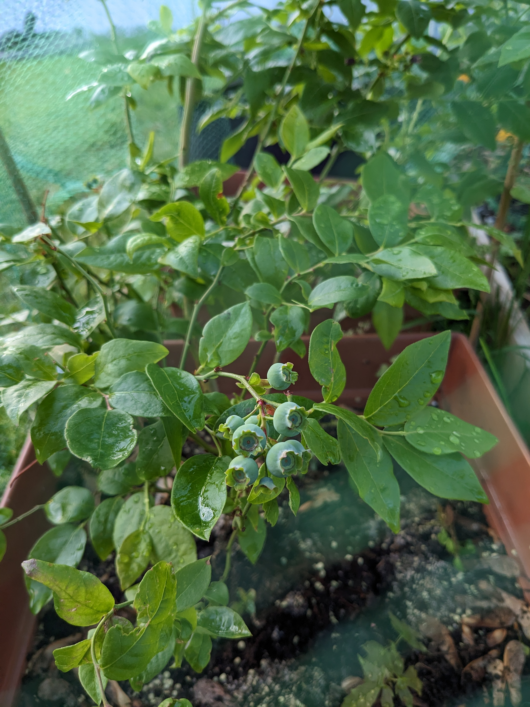
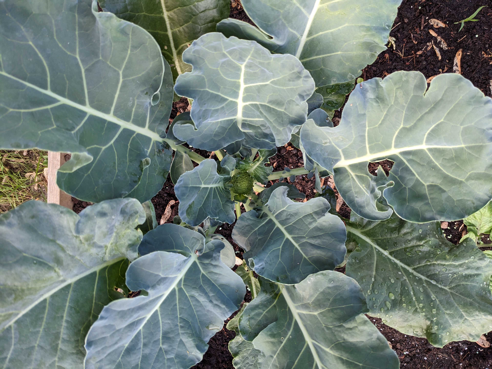
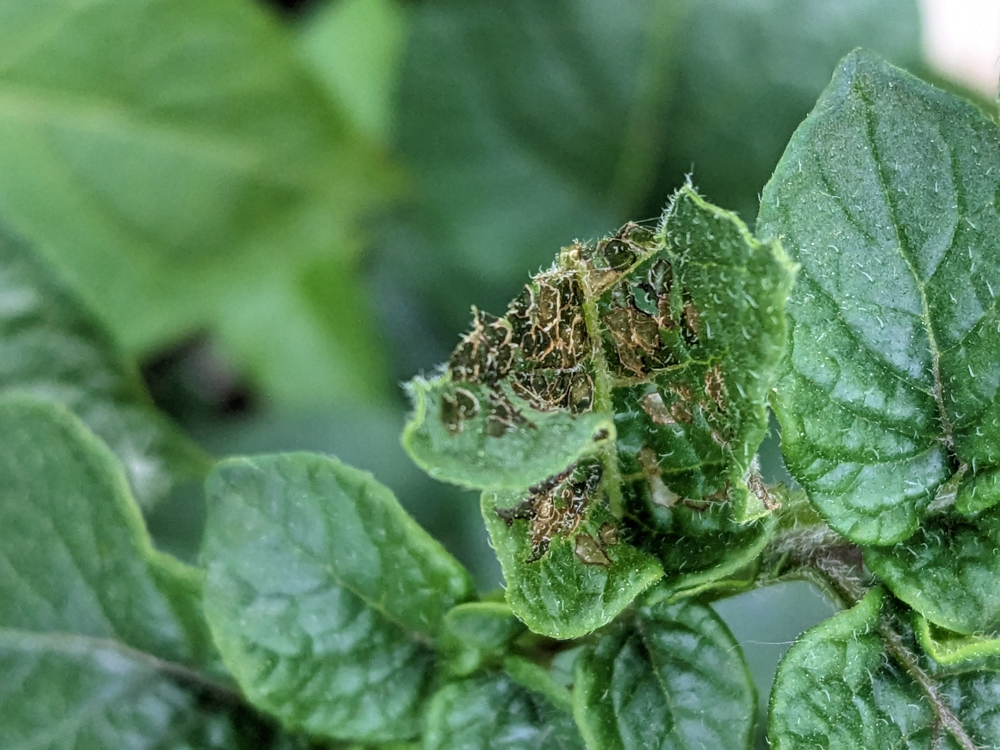
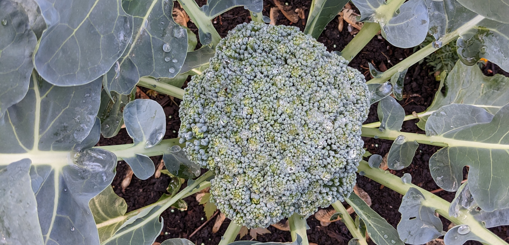

## Starting the garden

My husband went out to get starter plants for the garden right around the time I decided I was going to learn how to grow vegetables. With both of us having limited knowledge, we ended up with some plants that weren't suited to the time of year (then, about a month before the last frost) and plants that weren't suited to grow alongside each other. We decided to try it anyway and learn as we go.

This serves as a summary of my gardening notes, along with some progress photos until June 20th (summer solstice). The approximate last frost date was in the first week of May, for reference.

### April 22, 2023

* 2 blueberry bushes (Northland variety) potted in plastic planters

* 1 red rose plant potted in plastic planter

* 2 Romaine lettuces planted with chives in deck railing planter (partial sun)

* Parsley and dill planted in deck railing planter (partial sun)

* 4 types of mint planted in deck railing planter and 3 large plastic planters (partial sun)

* 2 broccoli plants in raised bed (mostly full sun)

* 6 cabbage plants in raised bed

### May 6, 2023

* Sweet potato vine planted in raised bed
  * started looking sad (yellowing) with roots growing out of bottom of seed tray
  * in ground, continued worsening, either root rot or a fungus

* 2 tomatoes in raised bed, they got leggy inside waiting for frost date to pass

* Broccoli plants have aphids. Sprayed with neem oil for a week before planting marigolds around the raised bed which kept everything in check

### May 14, 2023

Seeing a lot of growth! Near ready to start harvesting mint and parsley.

### May 18, 2023

* Purchased grow bags and planted:

  * Strawberries

  * Red potatoes

  * Basil

* Planted a new pepper and tomato plant in the raised bed to replace the dying sweet potato vine.

* Planted marigolds in raised bed and deck railing planters.

* Had a night or two of frosts and covered everything with blankets, towels, and tarps which worked.

### May 27, 2023

* Lettuce harvest! Mint and parsley harvests as well.

* Seeing more aphids on mint, despite marigolds there. Occasional neem oil use but otherwise just washing it all very well before using.

* Direct-sowed lettuce seeds in deck railing planter.

### May 31, 2023

### Early June

* Bugs are going after my strawberries before they're ready to harvest. I tried adding a cardboard barrier between the soil and the plant. I also tried adding some diatomaceous earth which should dry out the rolypoly bugs and kill them, but it doesn't seem to be working.

* Bugs are going after my potato plants, I think the Colorado potato beetle or something similar.

## Lessons and takeaways

1. Explore more ways to control aphids. Marigolds should always be planted, but we can probably do more to attract predator bugs.

1. Try to find straw mulch, especially for strawberries. I'm not currently using any mulch, which means I have to water frequently and do more to protect plants from the soil.

1. Establish an organic fertilizer routine. On the future farm, I expect to have more compost and fertilizer methods available than I do now. I think some of the plant growth stalling (ex, cabbage, basil, herbs) is due to lack of food available.

1. I'd like to eventually introduce predator bugs more to help handle aphids and worms/caterpillars on brassicas.

1. I'd like to do better at pruning tomato plants from the start. Each tomato plant has had a wildly different growth pattern based on their variety and how I've pruned it so far. Also, I'd like to use a Florida weave or other twine-based support system when we have a more permanent bed. I think I'm going to skip tomatoes next year.
