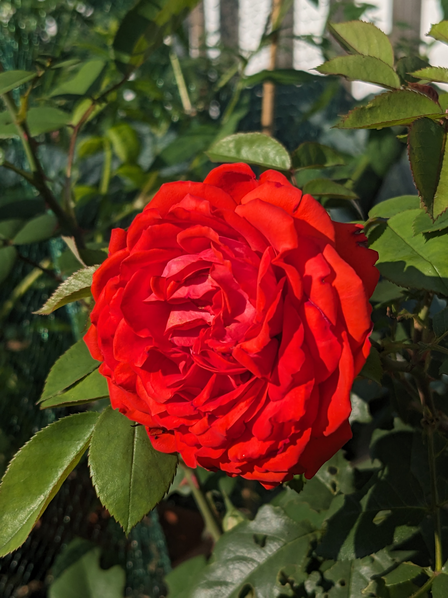
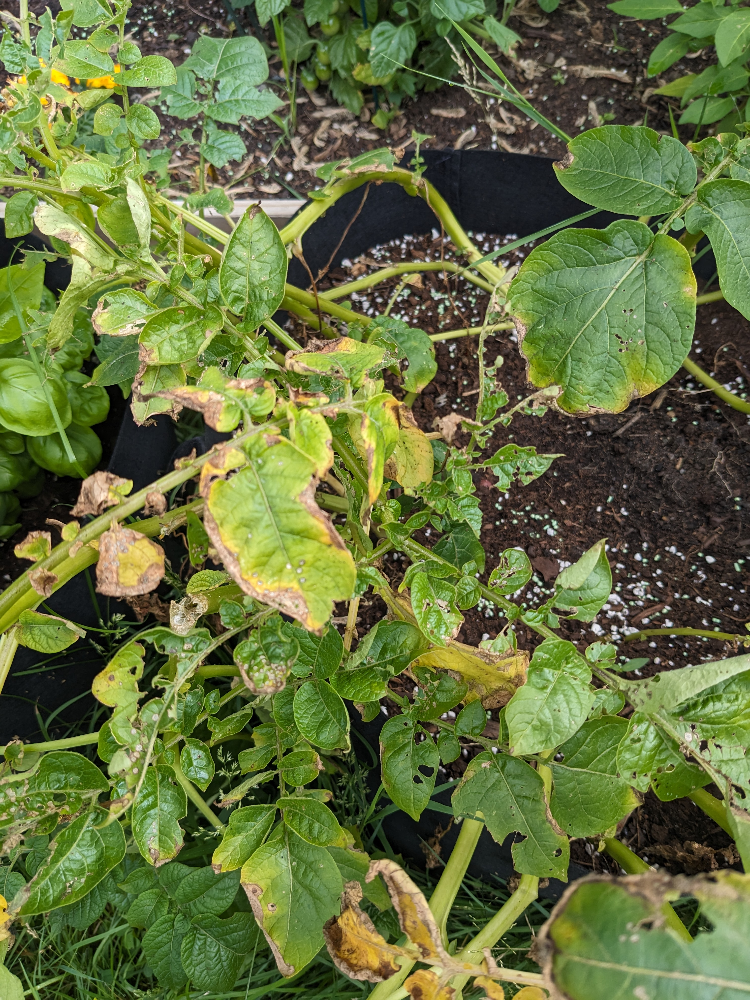
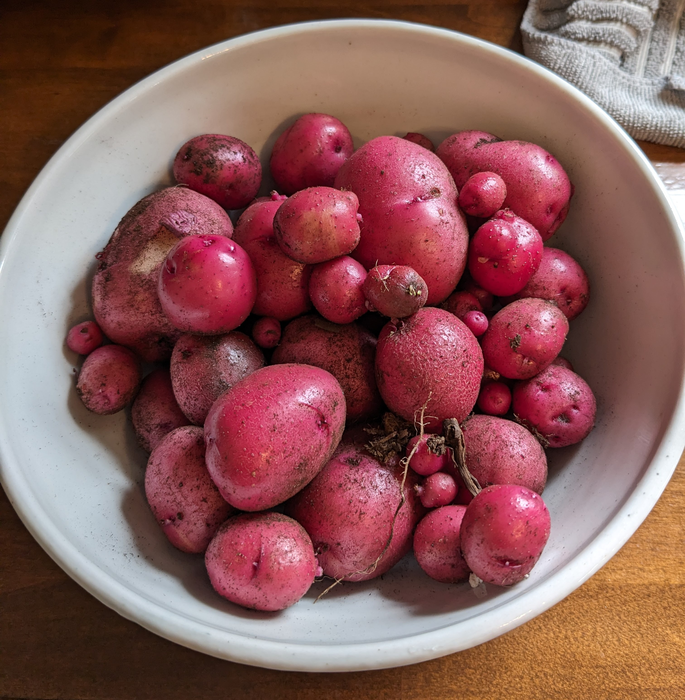
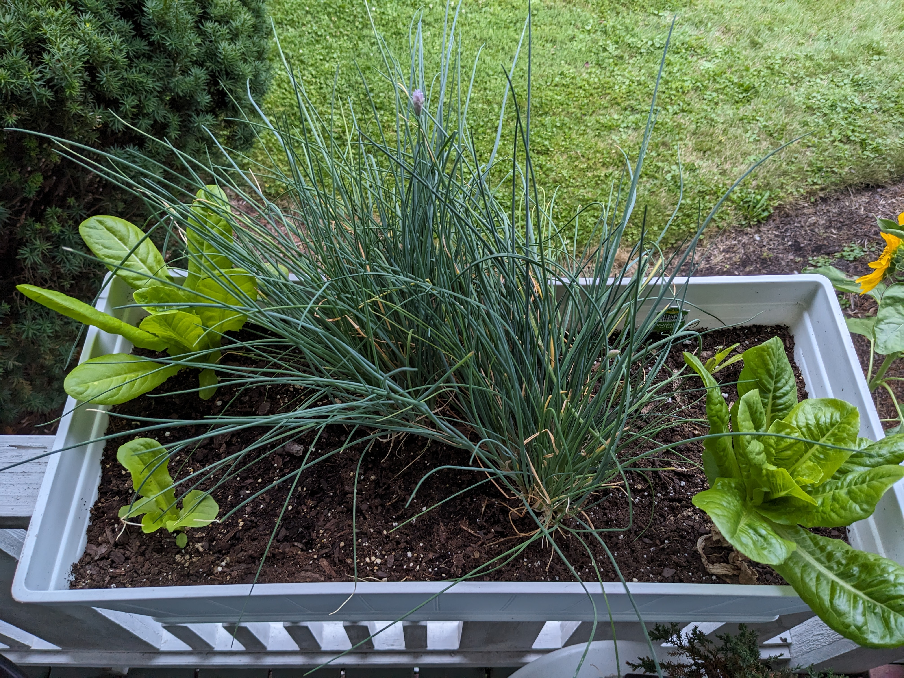

## Turnover and plans

The last broccoli harvest occurred on June 29th, 2023 and I had to tediously pick out easily a dozen caterpillars from each head. It didn't seem like the caterpillars appeared until very recently, so I'm not sure if this is a sign of a late harvest or that I should use netting next year to avoid these bugs.

The cabbage started to stall, probably because it was competing for resources with the tomatoes. As I was removing them, I noticed there were wasps coming in and eating bug eggs/larvae, which was cool to watch. It's nice to know there's a bit of an ecosystem existing in my garden. I removed the cabbage in an effort to prevent those eggs from hatching and spreading to other plants, as well as avoid any harm to the tomato plants which I would prefer to thrive over the cabbage.

The tomatoes have been challenging to keep pruned with the support options I have available to me, so I think next year I'll plan on focusing on broccoli and lettuce next year with netting to keep bugs off of them.

### June 29, 2023

* Harvested last of broccoli and pulled out the plants

* Started sunflowers by the garage and in the front garden

### July 7, 2023

* Removed cabbage

* I have new seeds coming soon and plan on planting fava bean cover crop where the broccoli and cabbage was to fix more nitrogen in the soil again. I'll also grow buckwheat after the fava beans to further enrich the soil and prep them for heavy-feeders in the spring (broccoli).

* Roses are looking awesome, and we found a volunteer hibiscus plant in another bed, so I think I'll start flowering perennial bushes by the garage for next year.

### July 9, 2023

### July 10, 2023

Planted buckwheat in the raised bed where the cabbage and broccoli used to be. My goal is to replenish phosphorous and nitrogen into the soil, and I'll use it as green manure to grow fava beans and/or lettuce in the same spot in the fall.

### July 16, 2023

The potato plants were looking worse today, with broken stems, which seemed like the final sign that they're done. The harvest was okay, but lots of small potatoes that hadn't really started. I'm guessing it was more than just the potato beetles that caused the damage, so I'll have to do more research before I try potatoes again.

I also was able to get my first batch of compost for the garden (started early last spring or even the fall before?). It looks really rich and dark, and I spread it over the empty (soon carrots) grow bag, both blueberry plants, and the rose bush.

Got 4x4 wood lengths to use as a garden edge by the garage for the bush/shrub garden. We need to pick up 1 cubic yard of top soil, and then I'll transplant the hibiscus and rose bushes.

Sunflowers are ~4' tall by the garage.

Buckwheat is sprouted at about 2 inches tall.

### July 18, 2023

Dug up the strawberries and threw them in the garbage because I was sick of feeding bugs and not myself.

The japanese beetles are really bad on the rose bush, so I got soapy water and knocked all the beetles I could find into it. I'll need to monitor a couple times a day until they're gone for good.

I also trimmed the blueberry flowers going to seed and the beetle-bitten parts of the rose bush.

### July 22, 2023

Added a new bed this weekend. we're going to let the top soil sit on the weeds/grass to kill it for a week or so before planting in rose bushes. This is just screened top soil and doesn't seem to have great drainage. I added 4 bags of compost/manure, but I think I'll need to top-dress with a thick layer of compost to make the bed healthy and well-draining for the bushes.

### July 23, 2023

Planted Shin Kuroda carrots direct-sow into a grow bag along with 2 coffee pots' worth of grounds and some leftover topsoil from yesterday's rose bed. Used a lot of seeds because I hear carrots are fickle to germinate and I want to make sure I have a good yield. I plan on thinning once they're a couple inches tall.

I'll likely harvest apple mint today to dry in the dehydrator for tea.

### July 30, 2023

The Botantical Interests buttercrunch lettuce seeds I got are sprouting so much faster than the Menards seeds (red coated).

2 cherry tomato plants are yielding ~5-10 tomatoes per day now.

Buckwheat seems to be growing very slowly.

Most of the Japanese beetles have left the roses alone, but I still find one every other day or so.

### August 11, 2023

Lettuce is doing really well. Like I said last time, the germination rate of the BI lettuce seeds is a lot more successful than the Menards seeds.

I added a bunch of compost and perlite to the rose bed. The top soil alone was really compacted and didn't drain well, so hopefully this helps before I plant the roses there.

Carrots are growing, though I'm worried about soil compaction on the top.

I didn't know exactly what types of peppers I planted, but it turns out all but 1 are banana/sweet peppers. I waited to see what they would be like if they turned red, and they're supposed to be more mild. I harvested about 60% of them today and used them in dinner.

And finally, I chopped all the buckwheat before it went to seed. Next time, I should plant it much closer together than what the packet suggested.

### August 20, 2023

* Pulled out the dill in the front deck railing planter and replaced it with 2 romaine lettuce.

* Pulled out dying basil in a grow bag and replaced it with radishes.

* Weeded raised bed, pruned and picked peppers.

* Planted carrot seeds in a grow bag, I probably should have started them earlier especially because I had the free space in the grow bag. They may be ready right around or after our first frost in mid-October.

* Planted bok choy on the south end of the raised bed.

* Planted more radishes on the north end of the raised bed.

* Parsley from the beginning of the season is finally doing well, I think I figured out how it prefers to be watered.

* Mulched non-vegetable beds. Probably need to get a straw bale to use as mulch on veggie beds and for over winter, but I need to think about it more.
